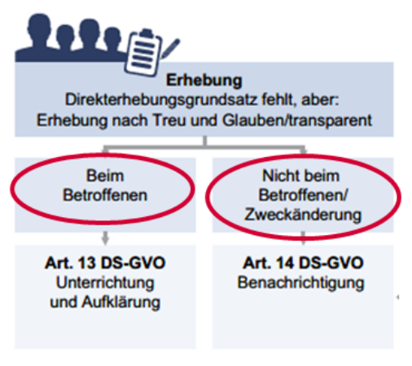
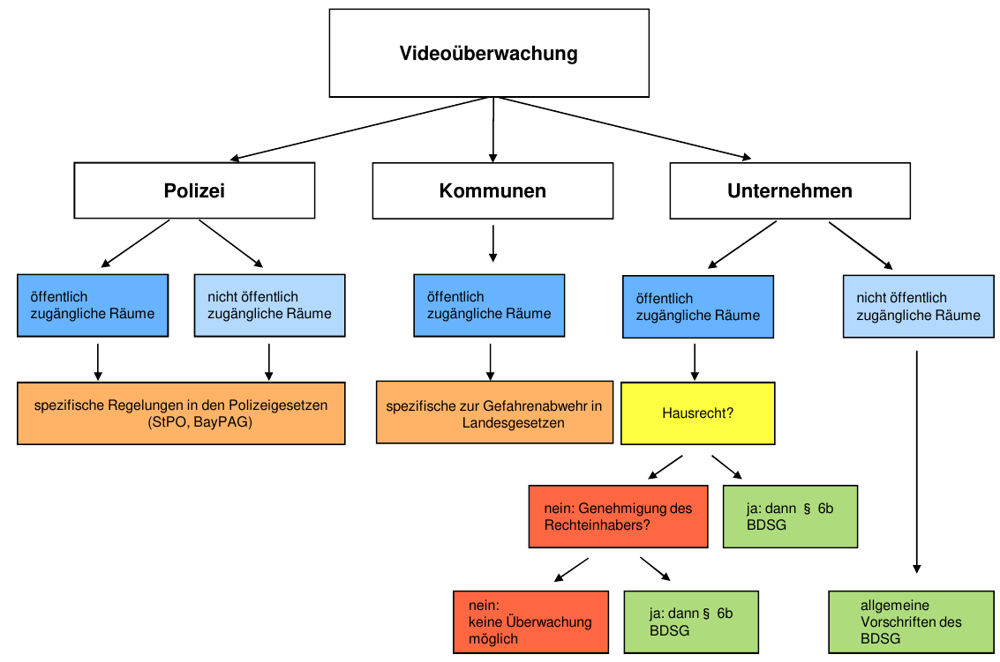

# Visualisierungen

# Paragraphen

## BDSG (Bundes Datenschutz Gesetz)
§1 Schutz des Einzelnen vor Persönlichkeitsrechts-Beeinträchtigung
1.  __Schutz__ und __keine Einschränkung__ des Verkehrs personenbezogener Daten
2.  keine Anwendung bei __persönlicher oder familiärer__ Nutzung

§6b Videoüberwachung
*   Klar erkennbarer Hinweis
*   erkennbarer Nutzungswille des Raumes
*   Kameraatrappen = keine Datenerhebung

§9 Schutzgewährleistung der erhobenen Daten (Abwägung: __Schutzwürdigkeit und Aufwand__)

### Erhebung/Verarbeiten/Übermitteln
§4 Zulässigkeit
1.  __Einwilligung__ falls nicht rechtlich und
2.  Ohne Mitwirkung falls __erforderlich__ oder __unverhältnismäßiger Aufwand__
3.  __Transparenz__ bei (Zweck, Verarbeitung, Nutzung, Empfänger)

§28 __(Für Verträge)__ DV erlaubt wenn __erforderlich für rechtsgeschäftliches Schuldverhältnis__ (vor - und nachvertraglich)

§29 __(Andere Zwecke)__ DV erlaubt wenn __kein schutzwürdiges Interesse__, __öffentliche quelle__

### Scoring
§28b für Entscheidung des Vertragsverhältnisses
*   Wissenschaftlich anerkannt
*   nur legale Daten
*   nicht nur Anschriftsdaten
*   __Unterrichtung__ bei nutzung v. Anschriftsdaten

### Auskunft auf Verlangen
§24 Auskunft über:
*   Identität
*   pers. und sachlichen Verhältnisse
*   Herkunft
*   Empfänger und Empfänger-Zielgruppe
*   Zweck
*   Scoring Werte

#### Verlangen
*   Schriftlich oder Mündlich (__keine Ablehnung, aber Aufforderung zur Präzision möglich__)
*   Unentgeltlich einmal jährlich

#### Löschung & Sperrung
§35
*   Wenn Speicherung __unzulässig__
*   nicht mehr für __Zweckerfüllung__ nötig
*   Prüfung nach __4 Jahren__
*   Sperrung falls:
    *   Aufbewahrungsfristen
    *   schutzwürdige Interessen
    *   unverhältnismäßiger Aufwand

### Einwilligung für Werbung
*   Werbeliste __(eigenes CRM, öffentliche Daten)__
*   Grundsätzlich __Schriftlich (mit Ausnamen)__

### Personenbezogene Daten
*   Bezieht sich auf __identifizierte__ oder __identifizierbare__ Person
*   Alle __verfügbaren Mittel__ und __gesammter Aufwand (nur BDSG)__ sind zu Betrachten
*   gilt nicht für __anonymisierte__ Daten
*   Sensibel:
    - Ethnik
    - Politische Einst.
    - Religion
    - Gerwerkschaft
    - Gesundheit
    - Sexualleben
    - genetische Daten __(GVO)__
    - biometrische Daten __(GVO)__

### Medium
Alles was direkt mit EDV zu tun hat
*   __Handschriftliches__ ausgeschlossen
*   __Beschäftigtendaten__ mediumsunabhängig

### Oursourcing (__Übermittlung__ pers. bez. Daten)
§11
*   Auftrag is Schriftlich
*   Regelmäßige Kontrollen

#### Im Ausland (nicht EU)
1.  gibt es Rechtsgrundlage
2.  existiert dort angemessenes Datenschutzniveau

## DS-GVO (EU-Datenschutz-Grundverordnung)
(1) Genau wie §1 im BDSG

### Erheben/Verarbeiten/Übermitteln
(5)
*   Rechtmäßigkeit
*   Zweckbindung
*   Datenminimierung
*   Löschung __falscher__ Daten
*   Löschung __nach Zweckbindung__ (Ausnamen: __Wissenschaft/Historie__)

### Rechtmäßigkeit
(6) wenn:
*   Einwilligung
*   Vertrag
*   [...]
*   Interessensabwägung
*   Zweckänderung

### Werbung
(6) Rechtsmäßigkeit der Verarbeitung
*   Werbeinteresse __<__ Peronenbezogene Daten
*   Wiederspruchsrecht

#### Einwilligung für Werbung
*   Vertragserfüllung __<->__ DV personenbezogener Daten
*   eindeutig bestätigend, __Opt In!__

### Auskunft auf Verlangen
#### Modalitäten
(12)
*   Transparenz (Form, Sprache)
*   1 Monat max
*   Unentgeltlich im Normalfall
*   Identitätsfeststellung

#### (15) Umfang
*   Personenbezogene Daten
*   Verarbeitungszwecke
*   Kategorisierung
*   Empfänger (Kategorie)
*   Speicherdauer
*   Hinweis auf Rechte
*   Informaitonen über Herkunft
*   Drittlandtransfehr

#### Grenzen/Ausnahmen
*   Einschrenkung d. Rechte u. Freiheiten anderer
*   präzision bei __großer__ Datenmenge
*   Forschung (§27 BDSG)
*   Gegen Rechtsvorschrift (z.B. §29 BDSG)
*   unverhältnismäßiger Aufwand

#### (16) Berichtigung
*   Berichtigung und Vervollständigung (__außer Forschung__)

#### (17) Löschung/Vergessen
*   Wegfall des Zwecks
*   keine Rechtsgrundlage
*   wenn Wiederspruchsrecht überwiegt

##### Vergessen (falls unrechtmäßig veröffentlicht)
Andere müssen auch Löschen

## KUG (Kunsturheberechts Gesetz)
§22 nur mit __Einwilligung__ (im Zweifel auch __bei Bezahlung__)

§23 Ausnamen
*   Zeitgeschichte
*   Personen nur als Beiwerk
*   höheres Interesse (Kunst)

## TMG
Plattformen mittels derer Inhalte angebonten werden

### Nutzungsdaten
*   Identifikation
*   Zeitangaben der Nutzung
*   in Anspruch genommene Inhalte

### Zweck
§15 (3)
*   Werbung
*   Marktforschung
*   Gestaltung
*   Mit Hinweis auf __Opt Out__

### Cookie
*   Wenn technisch erforderlich
*   E-Privacy Richtlinie fordert __Opt Out__

### Tell a Friend
*   reine Produktempfehlung
*   Private Absender
*   keine Versenderprämien
*   keine vorformulierten Texte
*   nur ein Empfänger
*   Hinweis auf Empfängereinverständnis

#### Auskunfteien
*   Wie kommt sie and Daten
    *   __keine Kreditinstitute__ (__Negativdaten__: Verpflichtung des Kunden)
        * Urteil
        * Mahnung
        * Insolvenz
    * __Kreditinstitute__ (__Positiv - und Negativdaten__)
        * Infos zu Bankgeschäften
        * wenn keine __schutzwürdigen Interessen__
        * nicht bei bloßen Anfragen
*   Wann werden Daten übermittelt
    * __konkretes__, __glaubhaftes__ und __berechtigtes__ Interesse

## Strafverfolgung (repressiv -> muss)
__Polizei, LKA, BKA__
### StPO
#### Ich muss
*   §48 Zeugenaussage
*   §94 Beschlagnahme v. Gegenständen
*   §100a Telekommunikationsüberwachung (falls verschlüsselt)
*   §100g Erhebung v. Verkehrsdaten (falls unverschlüsselt)
*   §102 Hausdurchsuchung

#### Ich muss nicht
*   §163 Fragen ohne Zeugenvorladung
*   pers. bezogene Informaitonen herausgeben
    §28.2 (BDSG) staatliche/öffentliche Sicherheit und kein schutzwürdiges Interesse

## Gefahrenabwehr (präventiv -> nach Ermessen)
__Polizei, LKA, BKA__
### BayPAG
#### Ich muss
*   (12) Befragung: Name, Vorname, Tag, Ort, Geburt, Wohnanschrift, Staatsangehörigkeit
*   (25) Sicherstellung von Sachen
*   (43a) Telekommunikationsüberwachung

#### Ich muss nicht
*   (30) Datenerhebung:
    *   nur wenn rechtlich zugelassen
    *   offen erheben (außer es geht nicht anders)

## Nachrichtendienste
*   Inland: Verfassungschutzbehörden (Bund und Länder)
*   Ausland: BSD
*   Bundeswehr: Militärischer Abwehrdienst

§8 (BVerfSchG)
2.  Methoden, Gegenstände und Instrumente zur heimlichen Informaitonsbeschaffung
4.  freiwillige Angaben zu pers. bez. Daten

## TKG
Infrastruktur-Anbieter (darf so wenig wie möglich mitbekommen)
*   §97 Speichern für: Entgeltermittlung und Abrechnung
    *   Verkehrsdaten bis 6 Monate, Bestandsdaten bis Jahresende
*   $100 Speichern für: Störungsbeseitigung/Missbrauchsbekämpfung
    *   Keine mindes/höchst Frist
    *   IP bis zu 7 Tage

### Fernmeldegeheimnis
§88 __Anbieter__ ist jeder der __geschäftsmäßig dauerhaft TK für Dritte__ erbringt

### Vorratsdatenspeicherung (10 Wochen)
#### Daten
*   Mobile Telefonie
    *   Standortdaten (4 Wochen)
*   Internetverbindung
    *   IP
    *   Nutzerkennung
    *   Datum, Uhrzeit, Beginn und Ende

#### Verwendung
*   §113b Übermittlung an Strafverfolgung und Gefahrenabwehr bei __besonders Schwehren Taten__
*   §113c §113d Sicherung und Protokollierung

## BFStrMG (Bundesfernstraßenmautgesetz)
§7 (2) __ausschließlich zur Überwachung der Gesetzvorschrift__
*   Fahrzeugbild
*   Name
*   Ort/Zeit
*   Kennzeichen

## Grundrechtsschutz (Opt In mit Ausnamen)
(1.1) GG __*Ich bestimme, wenn ich nicht will ist alles verboten (Ausnamen)*__
*   Individuum, freie Entfaltung
*   Schutz der Freiheit
*   Bedingung für Demokratie
*   Basis für soz. Integration
