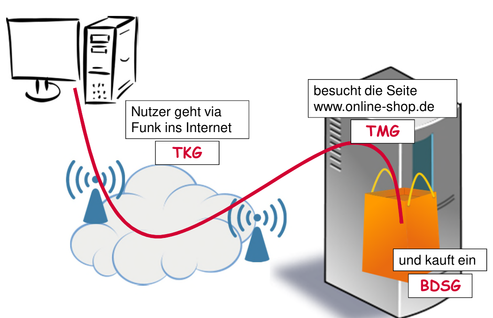

# Paragraphen

## BDSG (Bundes Datenschutz Gesetz)
§1 Schutz des Einzelnen vor Persönlichkeitsrechts-Beeinträchtigung
1.  __Schutz__ und __keine Einschränkung__ des Verkehrs personenbezogener Daten
2.  keine Anwendung bei __persönlicher oder familiärer__ Nutzung

### Verarbeitung
§4 Zulässigkeit
1.  __Einwilligung__ falls nicht rechtlich und
2.  Ohne Mitwirkung falls __erforderlich__ oder __unverhältnismäßiger Aufwand__
3.  __Transparenz__ bei (Zweck, Verarbeitung, Nutzung, Zielgruppe)

§28 __(Für Verträge)__ DV erlaubt wenn __erforderlich für rechtsgeschäftliches Schuldverhältnis__ (vor - und nachvertraglich)

§29 __(Andere Zwecke)__ DV erlaubt wenn __kein schutzwürdiges Interesse__, __öffentliche quelle__

### Einwilligung für Werbung
*   Werbeliste __(eigenes CRM, öffentliche Daten)__
*   Grundsätzlich __Schriftlich (mit Ausnamen)__

### Personenbezogene Daten
*   Bezieht sich auf __identifizierte__ oder __identifizierbare__ Person
*   Alle __verfügbaren Mittel__ und __gesammter Aufwand (nur BDSG)__ sind zu Betrachten
*   gilt nicht für __anonymisierte__ Daten
*   Sensibel:
    - Ethnik
    - Politische Einst.
    - Religion
    - Gerwerkschaft
    - Gesundheit
    - Sexualleben
    - genetische Daten __(GVO)__
    - biometrische Daten __(GVO)__

### Medium
Alles was direkt mit EDV zu tun hat
*   __Handschriftliches__ ausgeschlossen
*   __Beschäftigtendaten__ mediumsunabhängig

## DS-GVO (EU-Datenschutz-Grundverordnung)
(1) Genau wie §1 im BDSG

### Verarbeitung
(5)
*   Rechtmäßigkeit
*   Zweckbindung
*   Datenminimierung
*   Löschung __falscher__ Daten
*   Löschung __nach Zweckbindung__ (Ausnamen: __Wissenschaft/Historie__)

### Rechtmäßigkeit
(6) wenn:
*   Einwilligung
*   Vertrag
*   [...]
*   Interessensabwägung
*   Zweckänderung

### Werbung
(6) Rechtsmäßigkeit der Verarbeitung
*   Werbeinteresse __<__ Peronenbezogene Daten
*   Wiederspruchsrecht

#### Einwilligung für Werbung
*   Vertragserfüllung __<->__ DV personenbezogener Daten
*   eindeutig bestätigend, __Opt In!__

## KUG (Kunsturheberechts Gesetz)

## TMG

### Nutzungsdaten
*   Identifikation
*   Zeitangaben der Nutzung
*   in Anspruch genommene Inhalte

### Zweck
§15 (3)
*   Werbung
*   Marktforschung
*   Gestaltung
*   Mit Hinweis auf __Opt Out__

### Cookie
*   Wenn technisch erforderlich
*   E-Privacy Richtlinie fordert __Opt Out__

### Tell a Friend
*   reine Produktempfehlung
*   Private Absender
*   keine Versenderprämien
*   keine vorformulierten Texte
*   nur ein Empfänger
*   Hinweis auf Empfängereinverständnis

### Kundenüberprüfung
#### Scoring
für Entscheidung des Vertragsverhältnisses
*   Wissenschaftlich anerkannt
*   nur legale Daten
*   nicht nur Anschriftsdaten
*   __Unterrichtung__ bei nutzung v. Anschriftsdaten

#### Auskunfteien
*   Wie kommt sie and Daten
    *   __keine Kreditinstitute__ (__Negativdaten__: Verpflichtung des Kunden)
        * Urteil
        * Mahnung
        * Insolvenz
    * __Kreditinstitute__ (__Positiv - und Negativdaten__)
        * Infos zu Bankgeschäften
        * wenn keine __schutzwürdigen Interessen__
        * nicht bei bloßen Anfragen
*   Wann werden Daten übermittelt
    * __konkretes__, __glaubhaftes__ und __berechtigtes__ Interesse

## Strafverfolgung (repressiv -> muss)
### StPO
#### Ich muss
*   §48 Zeugenaussage
*   §94 Beschlagnahme v. Gegenständen
*   §100a Telekommunikationsüberwachung (falls verschlüsselt)
*   §100g Erhebung v. Verkehrsdaten (falls unverschlüsselt)
*   §102 Hausdurchsuchung

#### Ich muss nicht
*   §163 Fragen ohne Zeugenvorladung
*   pers. bezogene Informaitonen herausgeben
    §28.2 (BDSG) staatliche/öffentliche Sicherheit und kein schutzwürdiges Interesse

## Gefahrenabwehr (präventiv -> nach Ermessen)
### BayPAG
#### Ich muss
*   (12) Befragung: Name, Vorname, Tag, Ort, Geburt, Wohnanschrift, Staatsangehörigkeit
*   (25) Sicherstellung von Sachen
*   (43a) Telekommunikationsüberwachung

#### Ich muss nicht
*   (30) Datenerhebung:
    *   nur wenn rechtlich zugelassen
    *   offen erheben (außer es geht nicht anders)

## Nachrichtendienste
§8 (BVerfSchG)
2.  Methoden, Gegenstände und Instrumente zur heimlichen Informaitonsbeschaffung
4.  freiwillige Angaben zu pers. bez. Daten

## TKG

## BFStrMG (Bundesfernstraßenmautgesetz)
§7 (2) __ausschließlich zur Überwachung der Gesetzvorschrift__
*   Fahrzeugbild
*   Name
*   Ort/Zeit
*   Kennzeichen

## Grundrechtsschutz (Opt In mit Ausnamen)
(1.1) GG __*Ich bestimme, wenn ich nicht will ist alles verboten (Ausnamen)*__
*   Individuum, freie Entfaltung
*   Schutz der Freiheit
*   Bedingung für Demokratie
*   Basis für soz. Integration
